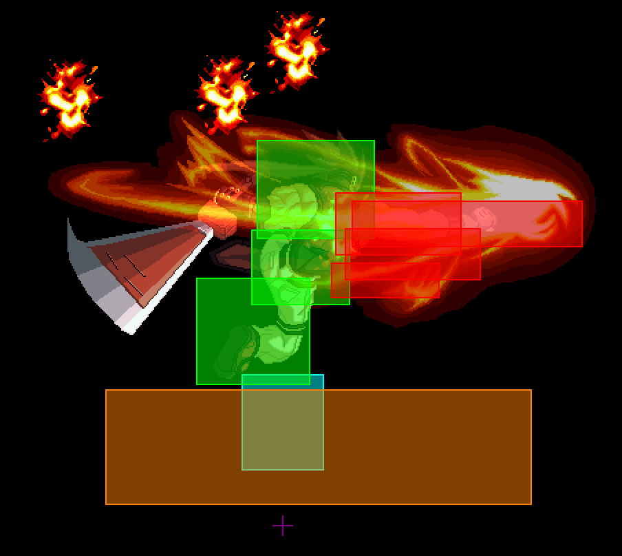
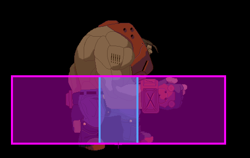
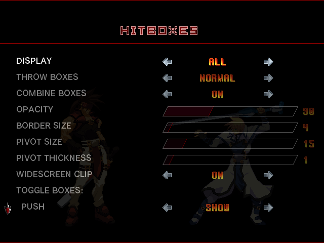
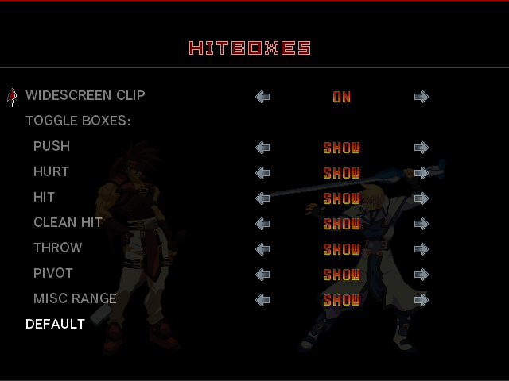

# ACPR_Hitboxes
A hitbox mod for Guilty Gear XX Accent Core Plus R via [GearLoader](https://github.com/YouKnow232/GearLoader) <br>
A partial port of [GGXXACPR_Overlay](https://github.com/YouKnow232/ggxxacpr_overlay)

## Installation

First download and install [GearLoader](https://github.com/YouKnow232/GearLoader). Then go to ACPR_Hitboxes' [releases](https://github.com/YouKnow232/ACPR_Hitboxes/releases) and download "Hitboxes.zip". Unzip it and put the "Hitboxes" folder into the "mods" folder. Folder structure should look like this:
```text
Guilty Gear XX Accent Core Plus R/
└── mods/
    └── Hitboxes/
```


## Hitboxes

|Thing        | Name          | Notes                                          |
| ---         | ---           | ---                                            |
|Red          | Hitbox        |                                                |
|Green        | Hurtbox       |                                                |
|Blue         | Pushbox       | Determines movement collision                  |
|Purple Cross | Pivot         | Actual character position, their origin point. |
|Orange       | Range Check   | Clean Hit box pictured. These boxes operate on the origin point instead of other boxes. |
|Pink         | Pushbox check | Command grab range pictured. These are range checks that operate on pushboxes. These usually only have a horizontal component with the exception of air throws. For air throws, the bottom of the pushbox needs to be in the air throw box. The box is extended to the height of the pushbox for the sake of visualization. |

<p>
   <br>
   <br>
  <em>Yup</em>
</p>

## Settings

The Mod Settings menu can be found in "Pause menu > Help & Options > Mod Settings".

<p>
   <br>
   <br>
</p>

* COMBINE BOXES groups hitboxes and hurtboxes into one shape.
* THROW BOXES can be set to ALWAYS to always show universal throw ranges. If a character does a command grab it will overwrite the universal throw box and display the command grab range instead for its active frames.
* WIDESCREEN CLIP hides the boxes behind the widescreen side bars. If set to OFF boxes will draw over them and you can see boxes past the left and right ends of the screen.
* For the individual box toggles, MISC RANGE groups together Orange range checks and Pink pushbox checks that aren't throw boxes or clean hit boxes.

These settings will save whenever the game would normally save its data.

## Known Issues

* When Combine Boxes is set to ON, border size may be inconsistent on certain projectiles.
